<div align="center">


# Openmind

**The self-hosted commonplace book.**

Save anything — a link, a quote, an image, a half-formed thought — and find it
again by a fragment: a colour, a word, a vibe.

[](LICENSE)
[](docs/self-hosting.md)
[](#ai-is-pluggable-never-assumed)

</div>

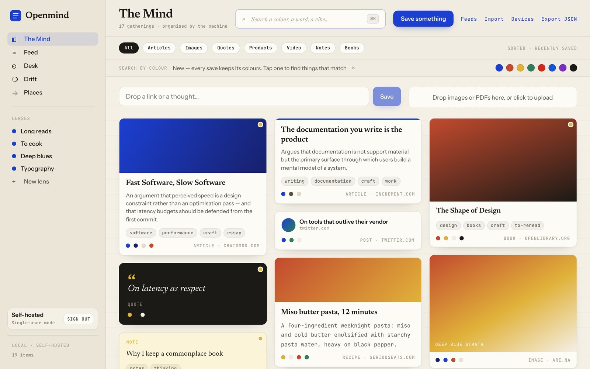

## Why

Most read-later apps are graveyards. You save something, it goes into a list,
the list becomes a backlog, the backlog becomes guilt.

A commonplace book works differently. For four centuries, people kept one
notebook for everything worth remembering — quotes, recipes, sketches,
overheard lines — and the value came from re-encountering things, sideways,
long after saving them.

Openmind is that, kept by a machine. You save in under a second. Enrichment
happens later, in the background, and never blocks you. Then the machine helps
you *stumble back into* what you kept.

- **Capture is sacred.** Saves return instantly. No AI call ever sits in the
  save path.
- **Your server, your data.** Postgres and one Go binary. `docker compose up`
  is the entire deployment. Export everything as JSON, any time.
- **AI is optional.** Every AI call goes through an adapter. With the `noop`
  provider the app stays fully functional — manual tags, full-text search.

---

## What it does

### Find things by a fragment

You rarely remember the title. You remember it was *blue*, or *about latency*,
or *that essay someone linked in March*. Search fuses Postgres full-text with
pgvector semantic similarity, and every save keeps its extracted palette — so
colour is a first-class filter.

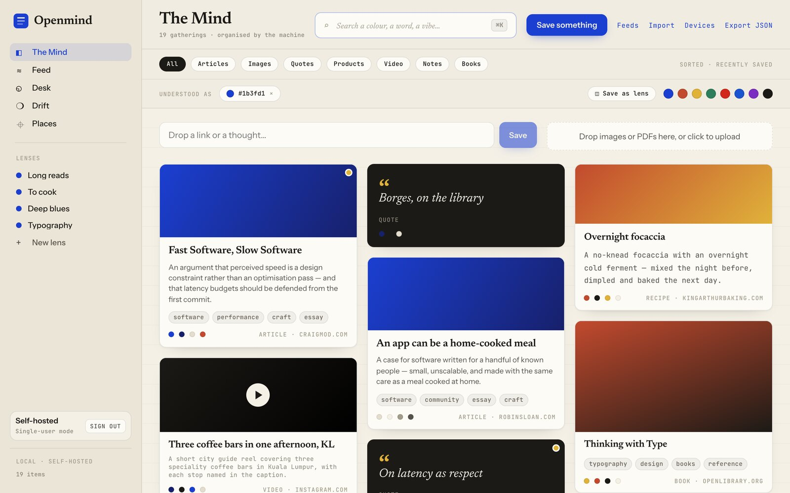

Type a phrase and results rank across full text and meaning together. Like what
you see? Save the query itself as a **Lens**.

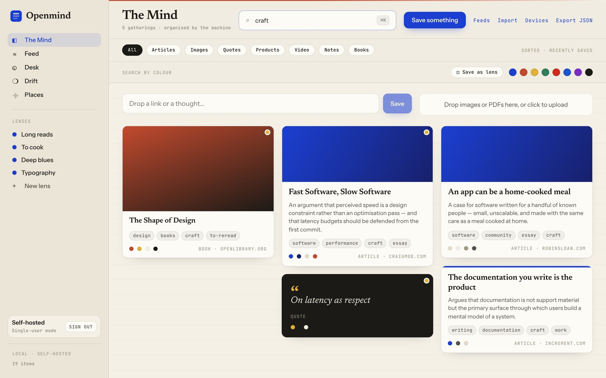

### Read without the web attached

Articles get a distraction-free reader. Highlight a passage and it becomes its
own quote card, linked back to where it came from.

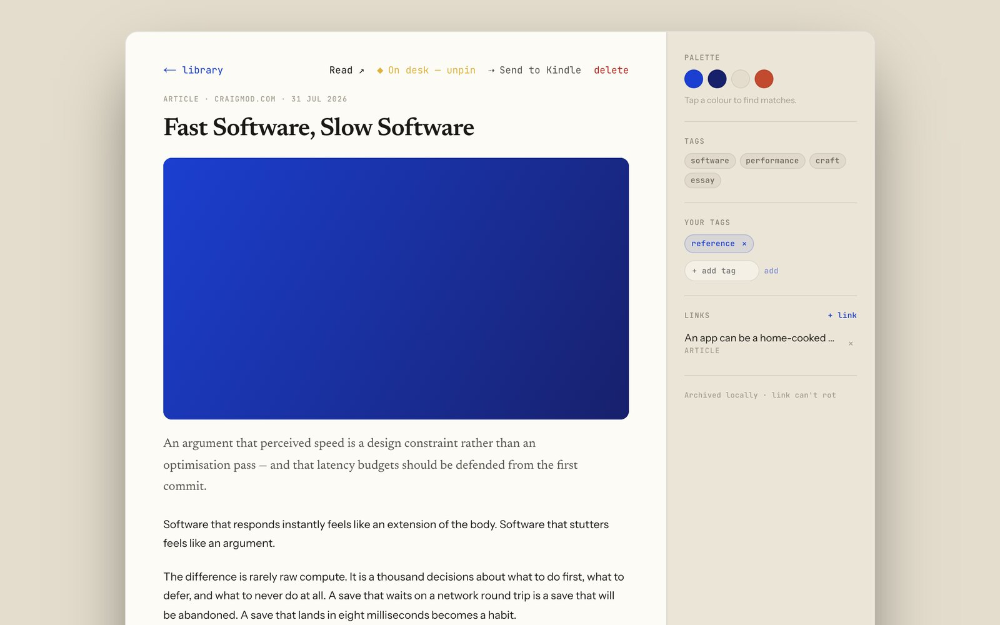

### Drift — the opposite of a backlog

Drift is a small daily ritual: a handful of forgotten saves, one at a time.
Keep it on your Desk, or let it go. No streaks, no counters, no guilt.

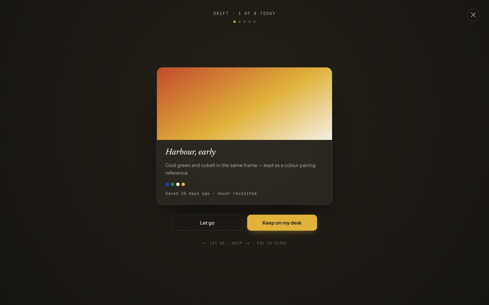

### Desk — what you're thinking about now

A pinboard for the handful of things currently live in your head. Pin from
anywhere; unpin when it stops mattering.

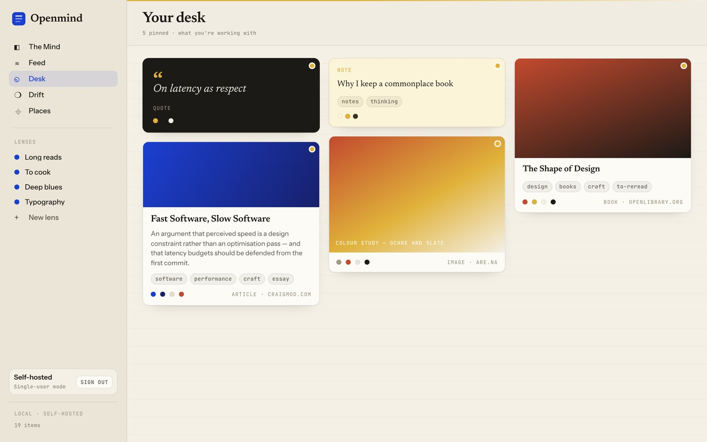

### Lenses — saved queries that stay live

A Lens is a query, not a folder. New saves fall into it automatically. Optional
digests can mail you what landed.

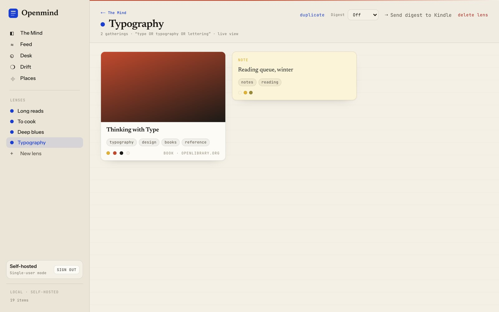

### Feeds, without an inbox

Subscribe to RSS/Atom and new items land in a **river** — searchable
immediately, but not part of your library until you keep one. Nothing
accumulates unread.

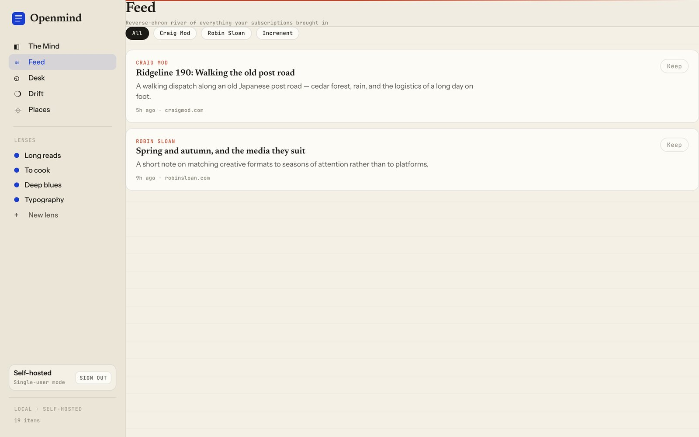

### Places

Save a video or post about somewhere and Openmind pulls the place names out of
the caption, geocodes them, and pins them on a map.

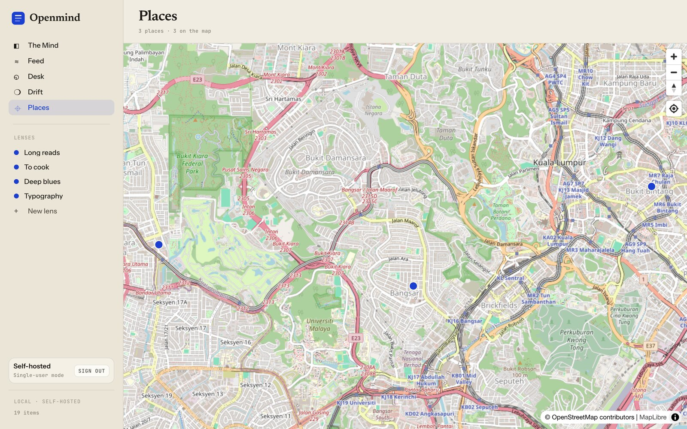

<details>
<summary><b>More: import, feed subscriptions, device keys</b></summary>

<br>

Bring an existing library in — browser bookmarks, Pocket, Raindrop, Pinboard,
Instapaper, an Omnivore zip, a CSV, or a plain list of URLs. Raindrop.io can
also be imported directly with an API test token, no export file needed —
your tags come along and collections become tags.

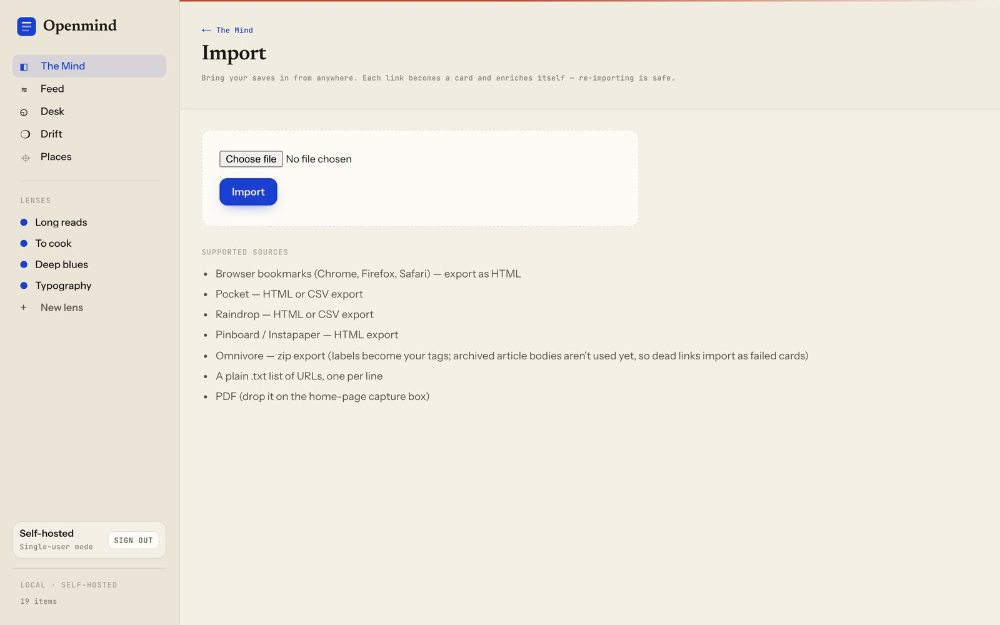

Manage feed subscriptions and see when each was last polled.

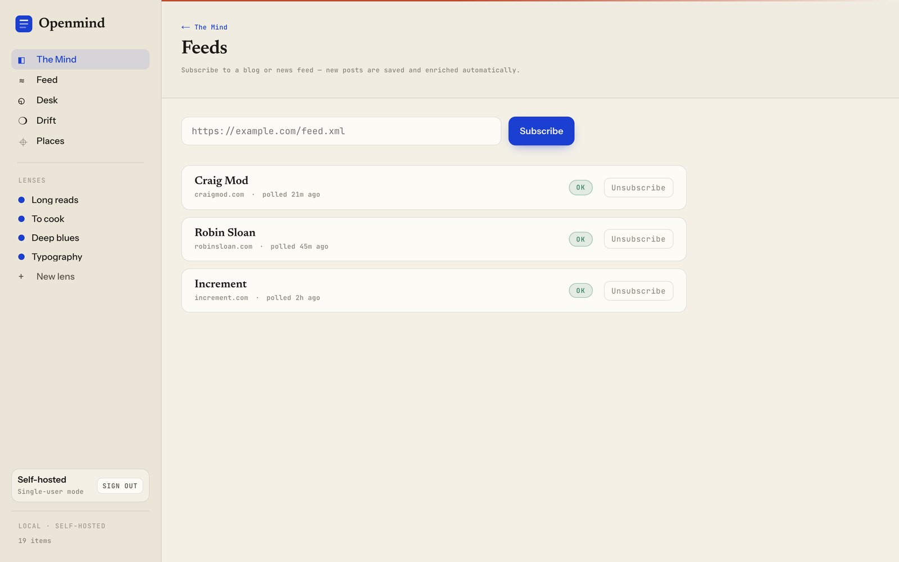

Mint and revoke per-device API keys, and generate short connect codes to pair
the extension or phone without pasting a token.

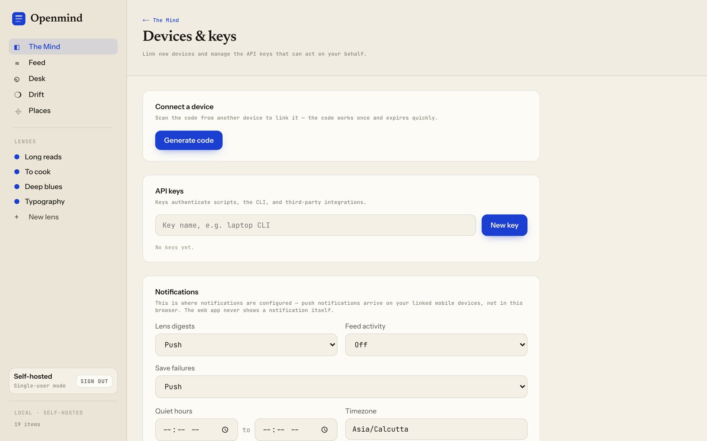

</details>

---

## Save from anywhere

| Client | What it's for | Status |
|---|---|---|
| **Web app** | The full library — search, read, Desk, Drift, Lenses | Shipped |
| **Browser extension** | One-click page save, right-click a selection or image, quick-tag | Shipped (Chrome/Edge/Brave + Firefox) |
| **Mobile** (Expo) | Share-sheet-first capture, offline photo queue | Shipped |
| **MCP server** | Let Claude and other agents search, save, tag, and pin | Shipped — 14 tools |
| **Desktop dock** (Tauri) | Floating quick-save / quick-find | In progress (P2) |
| **HTTP API** | Anything else — it's just `POST /api/items` | Shipped |

Every client is a thin capture surface. All enrichment logic lives server-side,
so a new client is only ever a few HTTP calls.

### Your agents get a key too

Openmind ships an MCP server, so an AI assistant can work against your library
directly — over Streamable HTTP or local stdio:

```
"Find that essay about latency I saved in March and pin it to my desk."
```

---

## Quickstart

```bash
git clone https://github.com/Rohithgilla12/open-mind.git
cd open-mind
docker compose up -d
open http://localhost:3000
```

That's Postgres plus one Go binary. No Redis, no Python sidecar, no message
broker — and there never will be. See
**[docs/self-hosting.md](docs/self-hosting.md)** for auth modes, AI providers,
backups, and reverse-proxy setup.

### AI is pluggable, never assumed

Enrichment deliberately runs on cheap models, and degrades rather than breaks:

| Provider | Notes |
|---|---|
| `noop` | **Default.** No AI at all. Manual tags + full-text search. Fully functional. |
| Gemini Flash-Lite | Cheapest hosted default |
| Any OpenAI-compatible endpoint | DeepSeek, Groq, Cerebras, vLLM, LM Studio… |
| Ollama | Fully local, nothing leaves your machine |

Providers form an ordered fallback chain: a 429 falls through to the next one
rather than failing the job. No flagship model is ever wired into the pipeline.

---

## How it's built

```
apps/api/          Go — HTTP API + River job workers, one binary
  internal/enrich/   pipeline: extract → classify → summarise → embed
  internal/ai/       provider adapters + ordered fallback chain
  internal/search/   hybrid Postgres FTS + pgvector rank fusion
  internal/store/    sqlc queries + migrations
apps/web/          Next.js
apps/extension/    WXT (React)
apps/mobile/       Expo
apps/dock/         Tauri
packages/api-client/  TS client — GENERATED from openapi.yaml
packages/ui/          Design tokens + shared components
openapi.yaml       The contract — single source of truth
```

Three rules hold the shape:

1. **`openapi.yaml` is the spine.** Edit the spec, run `task generate`, then
   implement. No hand-written API types, no route that isn't in the spec.
2. **Every job is idempotent.** Enrichment failures never corrupt a save, and
   every job is safe to re-run. Each has a test that proves it.
3. **Every table has `user_id`.** Multi-tenant from the first migration; a
   query without a `user_id` predicate is a bug. Single-user self-hosting is
   just an auto-provisioned account.

```bash
task dev        # postgres + Go live-reload + web
task test       # go test ./... + turbo run test
task generate   # openapi + sqlc codegen
task --list     # everything else
```

---

## Contributing

See **[CONTRIBUTING.md](CONTRIBUTING.md)**. Commits need a `Signed-off-by`
line (DCO) — `git commit -s`. The one convention worth repeating: change
`openapi.yaml` first, regenerate, then implement.

Found a security issue? **[SECURITY.md](SECURITY.md)** — please use private
vulnerability reporting rather than a public issue.

## Licence

**AGPL-3.0** — see [LICENSE](LICENSE). Run it for yourself, modify it freely; if
you offer it to others as a network service, share your changes.

<br>

<div align="center">
<sub>

Openmind is an independent project, inspired by — but not affiliated with —
mymind.<br>
Screenshots show a generated mock library — see
<a href="tools/screenshots">tools/screenshots</a> to regenerate them.

</sub>
</div>
